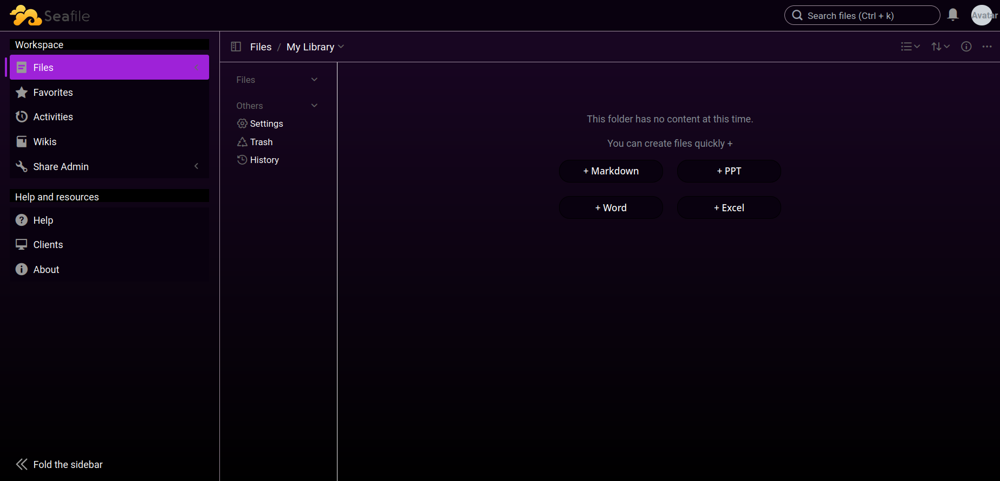
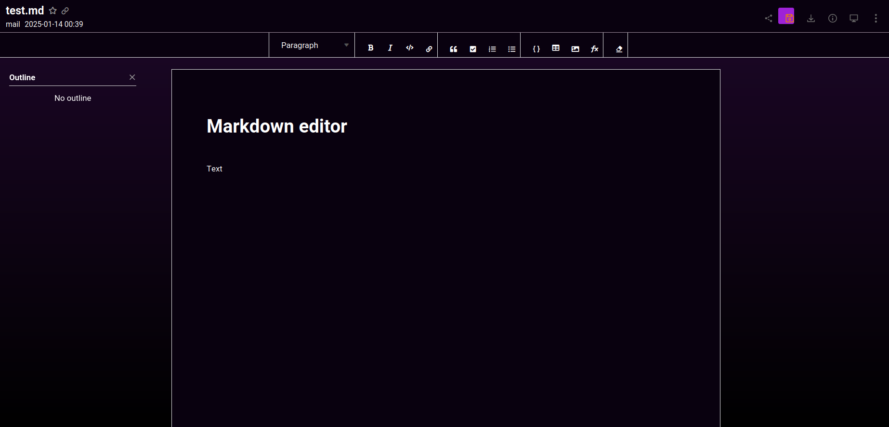

# Dark (Purple) theme for Seafile 12

A dark CSS theme for [Seafile](https://seafile.com) with a customizable primary color --- purple by default.

## Preview




## Usage

Go to `System Admin > Settings > Custom CSS`, paste the following code:
```css
@import url("https://zohiu.github.io/seafile-css/css/main.css")
```

Alternatively, go to https://zohiu.github.io/seafile-css/css/main.css directly and copy-paste the entire text into the custom css field.
